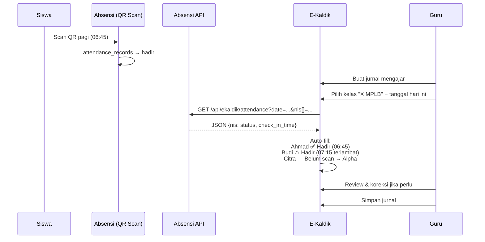

# Panduan Integrasi Absensi QR ↔ E-Kaldik (Jurnal Mengajar)

## Apa yang Berubah

Siswa yang sudah scan QR di sistem Absensi akan **otomatis tercatat hadir** saat guru membuat jurnal mengajar di E-Kaldik. Guru tetap bisa mengubah status secara manual.

---

## File yang Diubah

### Repo Absensi (`github.com/muochgack2-glitch/Absensi.git`) — Commit `87f30a7`

| File | Path di Server | Perubahan |
|------|---------------|----------|
| 🆕 `EkaldikController.php` | `/www/wwwroot/absensi/app/Http/Controllers/Api/` | API endpoint `GET /api/ekaldik/attendance` — return status scan per NIS |
| 🆕 `ValidateEkaldikApiKey.php` | `/www/wwwroot/absensi/app/Http/Middleware/` | Middleware validasi API key via header `X-API-Key` |
| ✏️ `api.php` | `/www/wwwroot/absensi/routes/` | Tambah route group `/api/ekaldik/*` |
| ✏️ `services.php` | `/www/wwwroot/absensi/config/` | Tambah config `ekaldik.api_key` |
| ✏️ `app.php` | `/www/wwwroot/absensi/bootstrap/` | Register middleware alias `ekaldik.api` |
| ✏️ `.env.example` | `/www/wwwroot/absensi/` | Tambah `EKALDIK_API_KEY` |

### Repo E-Kaldik (`github.com/muochgack2-glitch/simkur.git`) — Commit `cf0b0b9`

| File | Path di Server | Perubahan |
|------|---------------|----------|
| 🆕 `AbsensiApiService.php` | `/www/wwwroot/simkur/app/Services/` | Service consume API Absensi (timeout 3s, fallback graceful) |
| ✏️ `Create.php` | `/www/wwwroot/simkur/app/Livewire/TeachingJournal/` | `loadStudents()` auto-fill via API + property `$scanStatuses` |
| ✏️ `Edit.php` | `/www/wwwroot/simkur/app/Livewire/TeachingJournal/` | `loadStudentsForClass()` auto-fill via API |
| ✏️ `create.blade.php` | `/www/wwwroot/simkur/resources/views/livewire/teaching-journal/` | Kolom "Scan QR" dengan indikator waktu scan |
| ✏️ `services.php` | `/www/wwwroot/simkur/config/` | Tambah config `absensi.api_url` & `absensi.api_key` |
| ✏️ `.env.production-template` | `/www/wwwroot/simkur/` | Tambah `ABSENSI_API_URL` & `ABSENSI_API_KEY` |

---

## Alur Kerja Setelah Integrasi



---

## Langkah Deploy Production

> [!IMPORTANT]
> Deploy **Absensi dulu**, baru **E-Kaldik**. Jika E-Kaldik dideploy duluan, fallback aktif (semua default hadir — behavior lama).

### 1. Generate API Key

```bash
# Generate random key (jalankan di terminal manapun)
php -r "echo bin2hex(random_bytes(32)) . PHP_EOL;"
# Contoh output: a1b2c3d4e5f6...
```

Catat key ini, akan dipakai di kedua sistem.

### 2. Deploy Absensi

```bash
cd /www/wwwroot/absensi
git pull origin main

# Tambahkan ke .env:
nano .env
# Tambah baris:
# EKALDIK_API_KEY=a1b2c3d4e5f6...  (key yang digenerate tadi)

php artisan config:cache
```

### 3. Test API Absensi

```bash
# Test tanpa API key (jika EKALDIK_API_KEY kosong)
curl "https://absensi.smkpgriblora.sch.id/api/ekaldik/attendance?date=2026-08-13&nis[]=12345"

# Test dengan API key
curl -H "X-API-Key: a1b2c3d4e5f6..." "https://absensi.smkpgriblora.sch.id/api/ekaldik/attendance?date=2026-08-13&nis[]=12345"

# Expected response:
# {"success":true,"data":{"12345":{"status":"hadir","check_in_time":"06:45:00",...}},"date":"2026-08-13","queried":1,"found":1}
```

### 4. Deploy E-Kaldik

```bash
cd /www/wwwroot/simkur
git pull origin main

# Tambahkan ke .env:
nano .env
# Tambah baris:
# ABSENSI_API_URL=https://absensi.smkpgriblora.sch.id
# ABSENSI_API_KEY=a1b2c3d4e5f6...  (key yang SAMA dengan Absensi)

php artisan config:cache
```

### 5. Test E-Kaldik

1. Login sebagai guru
2. Buat jurnal mengajar baru
3. Pilih kelas dan tanggal hari ini
4. Lihat daftar hadir — siswa yang sudah scan QR harus otomatis tercentang hadir
5. Kolom "Scan QR" harus menampilkan waktu scan

---

## Troubleshooting

| Masalah | Penyebab | Solusi |
|---------|----------|-------|
| Semua siswa default hadir (behavior lama) | API gagal / key tidak match | Cek log `/www/wwwroot/simkur/storage/logs/laravel.log`, cari "Gagal ambil data absensi" |
| Response 401 Unauthorized | API key tidak cocok | Pastikan `EKALDIK_API_KEY` di `/www/wwwroot/absensi/.env` = `ABSENSI_API_KEY` di `/www/wwwroot/simkur/.env` |
| Siswa tidak ditemukan di Absensi | NIS tidak terdaftar di attendance_students | Pastikan siswa sudah di-input di kedua sistem dengan NIS yang sama |
| Kolom "Scan QR" kosong | `$scanStatuses` tidak terisi | Jalankan `cd /www/wwwroot/simkur && php artisan config:cache` |
